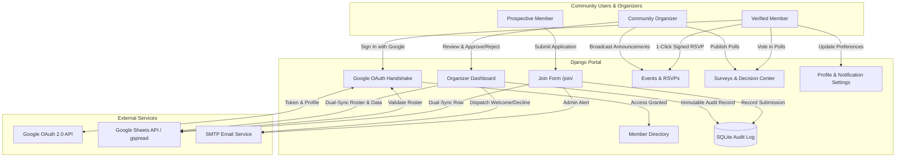

# MiniMexitas Community Portal 🇲🇽✨

[](https://www.python.org/)
[](https://www.djangoproject.com/)
[]()
[]()
[](https://github.com/pemujo/minimexas/actions)

A private, gated web portal and community management platform for the **MiniMexitas** Mexican community across the San Francisco Bay Area. The platform connects verified families, organizes regional meetups, powers community decision polls, curates local recommendations, and streamlines membership admissions with automated workflows and email notifications.

---

## 📑 Table of Contents

- [Overview & Architecture](#-overview--architecture)
- [Key Features](#-key-features)
- [Tech Stack](#-tech-stack)
- [Local Development Setup](#-local-development-setup)
- [Environment Configuration (`.env`)](#-environment-configuration-env)
- [Google Cloud & Spreadsheet Setup](#-google-cloud--spreadsheet-setup)
- [Testing & Continuous Integration (CI)](#-testing--continuous-integration-ci)
- [Deployment Guide (PythonAnywhere)](#-deployment-guide-pythonanywhere)
- [Security & Privacy Standards](#-security--privacy-standards)

---

## 🏗 Overview & Architecture

MiniMexitas operates on a **hybrid source-of-truth architecture**:
1. **Google Sheets** serves as the central administrative ledger for community organizers to inspect rosters, manage roles, view event RSVPs, and curate recommendations.
2. **Django + SQLite** powers the responsive web application, authenticated member sessions, fast cached queries, applicant review workflows, interactive surveys, event management, and immutable audit logging.
3. **Google OAuth 2.0** enforces strict gated single sign-on (SSO), ensuring only verified members on the active roster gain access to community resources.



---

## ✨ Key Features

- **🔒 Gated Single Sign-On (Google OAuth 2.0)**:
  - Strict domain and account verification against approved members.
  - Role-based permissions (`Member` vs `Admin` / `Organizer`).
  - Protection against CSRF, expired states, and session fixation.

- **🗳️ Surveys & Community Decision Center (`/surveys/`)**:
  - Interactive community polling with categorized topics (*Community, Event Planning, Meetup, General*).
  - Single-choice and multiple-choice voting modes with live percentage distribution bars.
  - Instant and re-broadcast email announcements sent to subscribed members.
  - Organizer controls to create, close/re-open, broadcast, and delete surveys.

- **📅 Community Events & 1-Click Signed RSVPs (`/events/`)**:
  - In-portal event scheduling with location links and automatic *"Add to Google Calendar"* generation.
  - One-click tokenized RSVP email links (`Going`, `Maybe`, `Declined`) using cryptographically signed tokens.
  - Live RSVP attendance tracking and breakdown.
  - Instant email broadcasts with rich HTML formatting and dynamic action buttons.

- **🔔 Member Notification Preferences (`/profile/`)**:
  - Self-service toggle allowing members to opt-in or opt-out of community broadcast emails at any time.
  - Notification badges displayed in the organizer member directory.
  - Broadcast engine automatically respects member preferences and only delivers to opted-in active members.

- **📝 Membership Application & Review Queue (`/join/` & `/organizers/`)**:
  - Public `/join/` application form with real-time field validation.
  - Instant admin alert notifications dispatched upon new submissions.
  - Organizer queue featuring one-click approvals, mobile-optimized action controls, WhatsApp outreach buttons, and custom rejection feedback notes.

- **📋 Immutable Activity & Audit Logging**:
  - Append-only `MembershipAuditLog` recording every admission, rejection, member creation, deletion, and broadcast announcement.
  - Tracks timestamp, admin identity, applicant target, and review notes.

- **🔄 Bi-Directional Google Sheets Dual-Sync**:
  - Automated synchronization between SQLite and Google Sheets for roster members, pending requests, events, RSVPs, surveys, and votes.
  - One-click reconciliation engine to resolve roster changes and sync offline data.

- **📍 Member Directory & Regional Intelligence (`/directory/`)**:
  - Searchable directory of verified community members.
  - Regional groupings across the Bay Area (*San Francisco, East Bay, Peninsula, South Bay, North Bay*).
  - Regional member distribution analytics for event planning.
  - Direct WhatsApp links with prefilled greetings.

- **🌮 Curated Community Recommendations (`/`)**:
  - Categorized directory of authentic Mexican businesses, restaurants, doctors, schools, and cultural artisans.

- **📱 Mobile-First Responsive Design**:
  - Optimized for smartphones (iOS Safari and Android Chrome) with momentum scrolling, touch-friendly inputs, and responsive modal viewports.

- **🛡️ Self-Service Privacy & Account Deletion**:
  - Members can edit their profile information or permanently delete their account with complete data cleanup across SQLite and Google Sheets.

---

## 🛠 Tech Stack

- **Backend**: Python 3.12, Django 5.x / 6.x
- **Frontend**: Vanilla HTML5, Modern CSS3, Bootstrap 5.3, Bootstrap Icons
- **Integrations**: `gspread`, `google-auth`, Google OAuth 2.0, Google Calendar API
- **Database**: SQLite3 (Production on PythonAnywhere / Local Dev)
- **Email**: Django SMTP backend with dynamic Gmail SMTP sender resolution
- **CI/CD**: GitHub Actions automated matrix testing

---

## 🚀 Local Development Setup

### 1. Prerequisites
- Python 3.10+ installed on your machine.
- Git.
- A Google Cloud Service Account and OAuth 2.0 Web Client Credentials.

### 2. Clone and Setup Environment
```bash
# Clone the repository
git clone https://github.com/pemujo/minimexas.git
cd minimexas

# Create and activate a virtual environment
python3 -m venv .venv
source .venv/bin/activate

# Install dependencies
pip install -r requirements.txt
```

### 3. Configure `.env`
Copy the example environment configuration and fill in your credentials:
```bash
cp .env.example .env
```

### 4. Database Migrations
Run the database migrations:
```bash
python manage.py migrate
```

### 5. Start Development Server
```bash
python manage.py runserver
```
Visit `http://127.0.0.1:8000/` in your browser.

---

## ⚙️ Environment Configuration (`.env`)

| Variable | Required | Description | Example |
| :--- | :---: | :--- | :--- |
| `SECRET_KEY` | **Yes** | Cryptographic signing key for Django | `django-insecure-...` |
| `DEBUG` | **Yes** | Enable debug mode (`True` locally, `False` in prod) | `False` |
| `ALLOWED_HOSTS` | **Yes** | Comma-delimited list of valid domain names/hosts | `127.0.0.1,localhost,pemujo.pythonanywhere.com` |
| `PORTAL_BASE_URL` | **Yes** | Canonical public URL used in emails & invite links | `https://pemujo.pythonanywhere.com` |
| `GOOGLE_SHEET_KEY` | **Yes** | Spreadsheet ID from the Google Sheet URL | `1lL8cvfJn-HDtaGQq25vdTeF5V1w6vrkJ9HlUcnorUOA` |
| `GOOGLE_CLIENT_ID` | **Yes** | Google OAuth 2.0 Web Client ID | `...apps.googleusercontent.com` |
| `GOOGLE_CLIENT_SECRET` | **Yes** | Google OAuth 2.0 Web Client Secret | `GOCSPX-...` |
| `GOOGLE_SERVICE_ACCOUNT_JSON` | **Yes** | Minified single-line Service Account JSON string | `{"type":"service_account",...}` |
| `EMAIL_BACKEND` | No | Django email backend (`smtp` or `console`) | `django.core.mail.backends.smtp.EmailBackend` |
| `EMAIL_HOST` | No | SMTP server hostname | `smtp.gmail.com` |
| `EMAIL_PORT` | No | SMTP port (typically 587 for TLS) | `587` |
| `EMAIL_USE_TLS` | No | Enable TLS connection | `True` |
| `EMAIL_HOST_USER` | No | SMTP authentication username / Gmail address | `notificaciones@minimexitas.org` |
| `EMAIL_HOST_PASSWORD` | No | SMTP App Password (16-char Google App Password) | `abcd efgh ijkl mnop` |
| `DEFAULT_FROM_EMAIL` | No | Friendly sender name for outgoing emails | `MiniMexitas Community <user@gmail.com>` |

---

## 📊 Google Cloud & Spreadsheet Setup

### 1. Google Cloud Console
1. Go to the [Google Cloud Console](https://console.cloud.google.com/).
2. Create or select your project.
3. Enable the **Google Sheets API** and **Google Drive API**.
4. Under **APIs & Services > Credentials**:
   - Create an **OAuth 2.0 Web Client ID**:
     - Authorized JavaScript Origins: `http://127.0.0.1:8000`, `https://<your-subdomain>.pythonanywhere.com`
     - Authorized Redirect URIs: `http://127.0.0.1:8000/auth/callback/`, `https://<your-subdomain>.pythonanywhere.com/auth/callback/`
   - Create a **Service Account**:
     - Generate and download a JSON key.
     - Copy the Service Account client email (e.g. `sheets-sync@project.iam.gserviceaccount.com`).

### 2. Google Spreadsheet Structure
1. Open your target Google Spreadsheet.
2. Click **Share** and add your Service Account email with the **Editor** role.
3. Ensure the spreadsheet contains the following standard worksheets:

- **`Members`**: `Name`, `Gmail`, `Role`, `Phone`, `Region`, `City`, `Family Info`, `Interests`, `Bio`
- **`Pending_Requests`**: `Full Name`, `Email`, `Phone Number`, `Region`, `City`, `Referral Source`, `Status`, `Reviewed By`, `Reviewed At`, `Review Notes`
- **`Recomendaciones`**: `Categoría`, `Nombre`, `Recomendación`, `Dirección / Zona`, `Link / Teléfono`, `Notas`
- **`Events`**: `Event ID`, `Title`, `Category`, `Start Time`, `End Time`, `Location`, `Location URL`, `Description`, `Created By`, `Status`, `Updated At`
- **`Event_RSVPs`**: `Event ID`, `Event Title`, `Member Name`, `Member Email`, `RSVP Status`, `Notes`, `Updated At`
- **`Surveys_Polls`**: `Survey ID`, `Title`, `Category`, `Mode`, `Status`, `Created By`, `Created At`, `Options`, `Total Votes`
- **`Survey_Votes`**: `Vote ID`, `Survey ID`, `Survey Title`, `Option Text`, `Voter Name`, `Voter Email`, `Voted At`
- **`Audit_Log`**: `Timestamp`, `Action`, `Target Email`, `Target Name`, `Actor Name`, `Actor Email`, `Notes`

---

## 🧪 Testing & Continuous Integration (CI)

The codebase includes an automated test suite containing **147 tests** covering access control, survey polling, event RSVPs, notification preference toggling, audit logging, and Google API mock handling.

### Local Testing
```bash
# Run the entire test suite
python manage.py test recommendations

# Run with verbose output
python manage.py test recommendations --verbosity=2

# Check for missing migrations
python manage.py makemigrations --check --dry-run

# Run Django system integrity check
python manage.py check
```

### GitHub Actions CI Workflow
Continuous integration runs automatically on every push and pull request via [`.github/workflows/ci.yml`](.github/workflows/ci.yml) across Python 3.11 and 3.12:
- System & configuration validation
- Database migration sanity checks
- Static asset collection verification
- Execution of all 147 unit and integration tests

---

## 🌐 Deployment Guide (PythonAnywhere)

### 1. Pull Latest Code on Server
Open a Bash console on PythonAnywhere:
```bash
cd ~/minimexas_website
git pull origin main
```

### 2. Update Virtualenv & Database
```bash
source ~/.virtualenvs/minimexas-env/bin/activate
pip install -r requirements.txt
python manage.py migrate
python manage.py collectstatic --noinput
```

### 3. Verify `.env` Configuration
Ensure the `.env` file on PythonAnywhere contains the production `PORTAL_BASE_URL`, `DEBUG=False`, production `GOOGLE_SHEET_KEY`, and valid email SMTP credentials.

### 4. Reload Web Application
In the **Web** tab of PythonAnywhere, click the green **Reload <subdomain>.pythonanywhere.com** button.

---

## 🔒 Security & Privacy Standards

- **Environment Isolation**: No production secrets, service account credentials, or spreadsheet IDs are committed to source control.
- **CSRF & State Token Verification**: OAuth handshakes enforce cryptographically secure `state` tokens stored in user sessions.
- **Session Protection**: Sessions are cycled upon authentication (`cycle_key()`) to prevent session fixation attacks.
- **Signed RSVP Tokens**: Event 1-click response links use cryptographic signatures with timestamps to prevent spoofing or unauthorized changes.
- **Permission Boundary Enforcement**: Non-admin members attempting to access organizer management or survey creation routes are rejected with HTTP 403.
- **Zero Orphaned Data on Deletion**: When a member requests account deletion, records are purged simultaneously across SQLite and Google Sheets.
- **Auditable Governance**: All membership decisions and broadcast dispatches are permanently recorded in `MembershipAuditLog`.

---

## 📄 License & Ownership

Private repository and intellectual property of the **MiniMexitas Community**.  
All rights reserved. Unauthorized reproduction, distribution, or public scraping is strictly prohibited.

