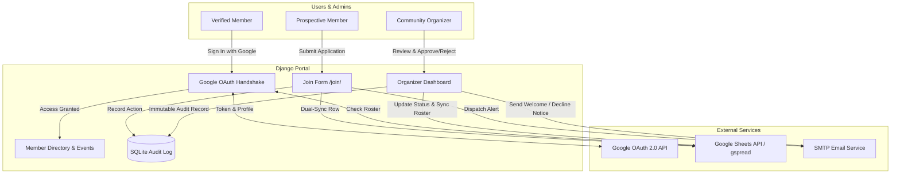

# MiniMexitas Community Portal 🇲🇽✨

[](https://www.python.org/)
[](https://www.djangoproject.com/)
[]()
[]()

A private, gated web portal and community management system for the **MiniMexitas** Mexican community across the San Francisco Bay Area. The platform connects verified families, organizes regional meetups, curates local recommendations, and automates membership admissions with bi-directional Google Sheets synchronization and email notifications.

---

## 📑 Table of Contents

- [Overview & Architecture](#-overview--architecture)
- [Key Features](#-key-features)
- [Tech Stack](#-tech-stack)
- [Local Development Setup](#-local-development-setup)
- [Environment Configuration (`.env`)](#-environment-configuration-env)
- [Google Cloud & Spreadsheet Setup](#-google-cloud--spreadsheet-setup)
- [Testing & Quality Assurance](#-testing--quality-assurance)
- [Deployment Guide (PythonAnywhere)](#-deployment-guide-pythonanywhere)
- [Security & Privacy Standards](#-security--privacy-standards)

---

## 🏗 Overview & Architecture

MiniMexitas operates on a **hybrid source-of-truth architecture**:
1. **Google Sheets** acts as the central, human-editable database for community organizers to view rosters, manage roles, and populate recommendations.
2. **Django + SQLite** provides the responsive web application layer, session security, fast cached queries, applicant review workflows, and immutable audit logging.
3. **Google OAuth 2.0** enforces strict gated single sign-on (SSO), verifying that incoming users match verified members in the active roster.



---

## ✨ Key Features

- **🔒 Gated Single Sign-On (Google OAuth 2.0)**:
  - Strict domain and account verification against approved members in Google Sheets.
  - Granular role-based access control (`Member` vs `Admin` / `Organizer`).
  - Protection against CSRF and session fixation attacks.

- **📝 Membership Application & Review Queue**:
  - Public `/join/` application form with client- and server-side validation.
  - Automated email notifications dispatched to all active organizers upon receiving a new application.
  - Organizer review queue with one-click approval, direct WhatsApp outreach buttons, and rejection workflows with customized feedback notes.

- **📋 Complete Activity & Audit Logging**:
  - Append-only `MembershipAuditLog` recording every submission, approval, rejection, direct member addition, and member removal.
  - Tracks timestamp, admin identity, applicant email, and review justification.

- **🔄 Bi-Directional Google Sheets Dual-Sync**:
  - Real-time synchronization for zero-data-loss protection between SQLite and Google Sheets (`Members` and `Pending_Requests` tabs).
  - One-click reconciliation engine to purge removed members and import newly added rows.

- **📍 Member Directory & Geographic Intelligence**:
  - Searchable directory of verified community members.
  - Regional grouping across the Bay Area (*San Francisco, East Bay, Peninsula, South Bay, North Bay*).
  - Geographic distribution progress bars and analytics for event planning.
  - Direct WhatsApp deep links with prefilled greetings.

- **🌮 Curated Community Recommendations & Events**:
  - Filterable directory of authentic Mexican businesses, doctors, restaurants, schools, and cultural events.
  - One-click *"Add to Google Calendar"* event integration.

- **🛡️ Self-Service Privacy & Account Deletion**:
  - Members can edit their public profiles or delete their accounts at any time, instantly removing their data from both SQLite and Google Sheets.

---

## 🛠 Tech Stack

- **Backend**: Python 3.12, Django 5.x
- **Frontend**: Vanilla HTML5 / Modern CSS3, Bootstrap 5.3, Bootstrap Icons
- **Integrations**: `gspread`, `google-auth`, Google OAuth2 API, Google Calendar API
- **Database**: SQLite3 (Production on PythonAnywhere / Local Dev)
- **Email**: Django SMTP backend (Gmail SMTP or Transactional Provider)

---

## 🚀 Local Development Setup

### 1. Prerequisites
- Python 3.10+ installed on your machine.
- Git.
- A Google Cloud Service Account and OAuth 2.0 Client Credentials (see [Google Cloud Setup](#-google-cloud--spreadsheet-setup)).

### 2. Clone and Setup Environment
```bash
# Clone the repository
git clone https://github.com/pemujo/minimexas.git
cd minimexas

# Create and activate a virtual environment
python3 -m venv .venv
source .venv/bin/activate

# Install dependencies
pip install -r requirements.txt
```

### 3. Configure `.env`
Copy the example environment configuration and fill in your credentials:
```bash
cp .env.example .env
```

### 4. Database Migrations
Run the initial database migrations:
```bash
python manage.py migrate
```

### 5. Start Development Server
```bash
python manage.py runserver
```
Visit `http://127.0.0.1:8000/` in your browser.

---

## ⚙️ Environment Configuration (`.env`)

| Variable | Required | Description | Example |
| :--- | :---: | :--- | :--- |
| `SECRET_KEY` | **Yes** | Cryptographic signing key for Django | `django-insecure-...` |
| `DEBUG` | **Yes** | Enable debug mode (`True` locally, `False` in prod) | `False` |
| `ALLOWED_HOSTS` | **Yes** | Comma-delimited list of valid domain names/hosts | `127.0.0.1,localhost,pemujo.pythonanywhere.com` |
| `PORTAL_BASE_URL` | **Yes** | Canonical public URL used in emails & invite links | `https://pemujo.pythonanywhere.com` |
| `GOOGLE_SHEET_KEY` | **Yes** | Spreadsheet ID from the Google Sheet URL | `1lL8cvfJn-HDtaGQq25vdTeF5V1w6vrkJ9HlUcnorUOA` |
| `GOOGLE_CLIENT_ID` | **Yes** | Google OAuth 2.0 Web Client ID | `...apps.googleusercontent.com` |
| `GOOGLE_CLIENT_SECRET` | **Yes** | Google OAuth 2.0 Web Client Secret | `GOCSPX-...` |
| `GOOGLE_SERVICE_ACCOUNT_JSON` | **Yes** | Minified single-line Service Account JSON string | `{"type":"service_account",...}` |
| `EMAIL_BACKEND` | No | Django email backend (`smtp` or `console`) | `django.core.mail.backends.smtp.EmailBackend` |
| `EMAIL_HOST` | No | SMTP server hostname | `smtp.gmail.com` |
| `EMAIL_PORT` | No | SMTP port (typically 587 for TLS) | `587` |
| `EMAIL_USE_TLS` | No | Enable TLS connection | `True` |
| `EMAIL_HOST_USER` | No | SMTP authentication username / Gmail address | `notificaciones@minimexitas.org` |
| `EMAIL_HOST_PASSWORD` | No | SMTP App Password (16-char Google App Password) | `abcd efgh ijkl mnop` |
| `DEFAULT_FROM_EMAIL` | No | Friendly sender name for outgoing emails | `MiniMexitas Community <no-reply@minimexitas.org>` |

---

## 📊 Google Cloud & Spreadsheet Setup

### 1. Google Cloud Console
1. Go to the [Google Cloud Console](https://console.cloud.google.com/).
2. Create or select your project.
3. Enable the following APIs:
   - **Google Sheets API**
   - **Google Drive API**
4. Under **APIs & Services > Credentials**:
   - Create an **OAuth 2.0 Web Client ID**:
     - Authorized JavaScript Origins: `http://127.0.0.1:8000`, `https://<your-subdomain>.pythonanywhere.com`
     - Authorized Redirect URIs: `http://127.0.0.1:8000/auth/callback/`, `https://<your-subdomain>.pythonanywhere.com/auth/callback/`
   - Create a **Service Account**:
     - Generate and download a JSON key.
     - Copy the Service Account client email (e.g. `sheets-sync@project.iam.gserviceaccount.com`).

### 2. Google Spreadsheet Structure
1. Open your target Google Spreadsheet.
2. Click **Share** and add your Service Account email with the **Editor** role.
3. Ensure the spreadsheet contains the following three worksheets and header columns:

#### `Members` Tab
| Name | Gmail | Role | Phone | Region | City | Family Info | Interests | Bio |
| :--- | :--- | :--- | :--- | :--- | :--- | :--- | :--- | :--- |

*(Role column should contain `Admin`, `Organizer`, or `Member`)*

#### `Pending_Requests` Tab
| Full Name | Email | Phone Number | Region | City | Referral Source | Status | Reviewed By | Reviewed At | Review Notes |
| :--- | :--- | :--- | :--- | :--- | :--- | :--- | :--- | :--- | :--- |

#### `Recomendaciones` Tab (or `Notes`)
| Categoría | Nombre | Recomendación | Dirección / Zona | Link / Teléfono | Notas |
| :--- | :--- | :--- | :--- | :--- | :--- |

---

## 🧪 Testing & Quality Assurance

The codebase includes an extensive, fully isolated automated unit test suite. All Google API calls and SMTP dispatches are mocked during testing to prevent rate limits or live spreadsheet modifications.

To run all test cases:
```bash
python manage.py test recommendations
```

To run a specific test suite or test case:
```bash
python manage.py test recommendations.tests.AdminNotificationAndAuditLogTestCase
```

---

## 🌐 Deployment Guide (PythonAnywhere)

### 1. Pull Latest Code on Server
Open a Bash console on PythonAnywhere:
```bash
cd ~/minimexas_website
git pull origin main
```

### 2. Update Virtualenv & Database
```bash
source ~/.virtualenvs/minimexas-env/bin/activate
pip install -r requirements.txt
python manage.py migrate
python manage.py collectstatic --noinput
```

### 3. Verify `.env` Configuration
Ensure the `.env` file on PythonAnywhere contains the production `PORTAL_BASE_URL`, production `GOOGLE_SHEET_KEY`, and valid email credentials.

### 4. Reload Web Application
In the **Web** tab of PythonAnywhere, click the green **Reload <subdomain>.pythonanywhere.com** button.

---

## 🔒 Security & Privacy Standards

- **Environment Isolation**: No production secrets, service account credentials, or spreadsheet IDs are hardcoded in the repository.
- **CSRF & State Token Verification**: OAuth handshakes enforce cryptographically secure `state` tokens stored in user sessions.
- **Session Protection**: Sessions are cycled upon authentication (`cycle_key()`) to prevent session fixation attacks.
- **Zero Orphaned Data on Deletion**: When a user requests self-deletion or an admin removes a member, records are purged simultaneously across SQLite and the Google Sheet `Members` tab.
- **Auditable Governance**: All membership admissions and rejections are logged with reviewer metadata for community governance.

---

## 📄 License & Ownership

Private repository and intellectual property of the **MiniMexitas Community**.  
All rights reserved. Unauthorized reproduction, distribution, or public scraping is strictly prohibited.
